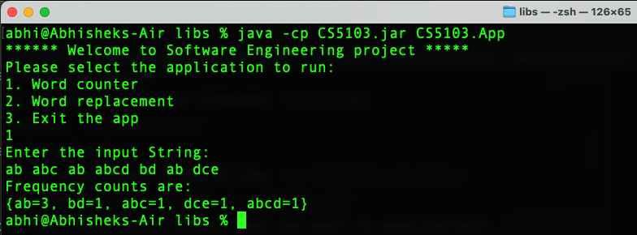
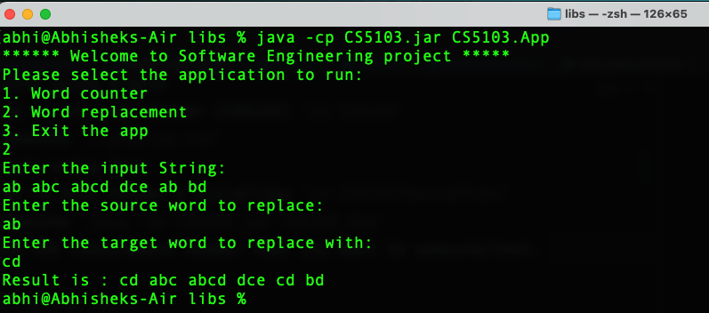

# CS5103 Software Engineering

## Strings and Words application 

The software program implements a set of string manipulation functions on a document, to gather various metrics on the words
stored in that document. We start with finding the unique words along with their frequencies and extend the application to 
perform several advanced functions.

## User stories
Repo Link is: https://github.com/abhishektiwari98/CS5103

All the user stories of the project are available here:
https://github.com/users/abhishektiwari98/projects/1/views/1

## Dev environment
This is a standalone Java application that is built using [Gradle](https://docs.gradle.org/current/userguide/userguide.html). 
The Gradle build system is easy to setup and takes care   
of managing dependencies (libraries needed by the application) using a declarative language. 

The project also uses IntellijIdea community addition IDE for the development process. 

### Setting up a gradle project
1. [Installing Gradle](https://docs.gradle.org/current/userguide/installation.html#installing_with_a_package_manager)
   1. `brew install gradle` on MacOS to install it. 
   2. If you are using M1 chip based Mac, use `arch -arm64 brew install` instead.
2. [Setting up Java project using Gradle](https://docs.gradle.org/current/samples/sample_building_java_applications.html)
   1. `gradle init` 
   2. Chose `application` as project type 
   3. Chose `Java` as language and setup without subjects
   4. Go with other defaults 
3. Build the application
   `./gradlew clean build`
4. Refresh the IDE to reload all the files

## Running the application
The project can be executed by Gradle or Java  
1. Execute using Gradle
   1. go to the main folder (CS5103) `cd CS5103`
   2. execute `./gradlew run`
2. Execute using Java
   1. Go to main folder's build/libs `cd CS5103/build/libs`
   2. Execute `java -cp CS5103.jar CS5103.App`
3. Chose the requirement number that you want to execute/test. 

## Running the tests
Tests can be executed with gradle as:  
`./gradlew test`

## Example runs  
1. Word counter sample run   

2. Word replacement sample run  
  

## References 
1. [Run main class from a jar](https://stackoverflow.com/questions/5474666/how-to-run-a-class-from-jar-which-is-not-the-main-class-in-its-manifest-file)
2. 
