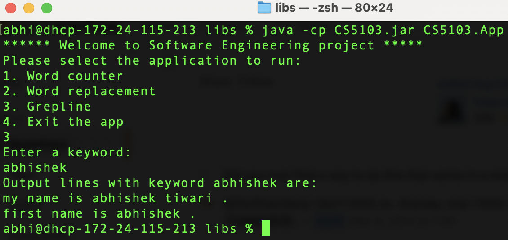

# CS5103 Software Engineering

## Specification
In this project, intially the program performs word statistics of a given string. First, it takes a string as input and counts the freaquency of each unique word given in the string. After taking the input string from user it returns the number of times each unique word occured. Word statistics also takes spaces tabs and new lines as seperators so even if the string consist of spaces, tabs and new lines it still returns the frequency of each word.

Then the project is extended with a feature which is to provide a replacement word for all occurences of a word in the string. So, first the program takes an input string, the word to replace and asks the user for the word that has to be in the place of replacement word. Then it returns the final string with word to be replaced given. Also the program only replaces the given word when it matches with the whole replacement word and not just the characters.

Additionally the project is extended with another feature called Grepline. Grepline takes a document and a keyword as input and return the lines from the document. The output lines must contain one occurence of the given keyword and the keyword must also match with the occurence word completely and not just few characters.

## Implementation (Strings and Words application)
The software program implements a set of string manipulation functions on a document, to gather various metrics on the words
stored in that document. We start with finding the unique words along with their frequencies and extend the application to 
perform several advanced functions.

## User stories and test cases
Repo Link is: https://github.com/abhishektiwari98/CS5103

All the user stories and test cases of the project are available here:
https://github.com/users/abhishektiwari98/projects/1/views/1

## Design change report
Initial design of this project displays a welcome output and the first requirement i.e. "Word counter" as choice 1. and 2 as "exit the app" to close the program. To execute first program, after executing the main project we enter 1 and execute then it asks for the required strings to perform the first requirement completely.

Then the second feature is added as "Word replacement" as choice 2 just like first. To perform second requirement completely, we enter 2 and execute. And then it asks for the words to replace in the string. Also, the feature "exit the app" shifts to no 3 after adding the second program.

The final design changes on the last feature which then is added as "Grepline" at no 3 and "Exit the app" shifts to choice no 4. To perform the third program(Grepline) we enter 3 and execute the program just like the first two programs. And finally, for executing "exit the app" we choose 4 and execute(enter button) and the whole program closes.

## Dev environment
This is a standalone Java application that is built using [Gradle](https://docs.gradle.org/current/userguide/userguide.html). 
The Gradle build system is easy to setup and takes care   
of managing dependencies (libraries needed by the application) using a declarative language. 

The project also uses IntellijIdea community addition IDE for the development process. 

### Setting up a gradle project
1. [Installing Gradle](https://docs.gradle.org/current/userguide/installation.html#installing_with_a_package_manager)
   1. `brew install gradle` on MacOS to install it. 
   2. If you are using M1 chip based Mac, use `arch -arm64 brew install` instead.
2. [Setting up Java project using Gradle](https://docs.gradle.org/current/samples/sample_building_java_applications.html)
   1. `gradle init` 
   2. Chose `application` as project type 
   3. Chose `Java` as language and setup without subjects
   4. Go with other defaults 
3. Build the application
   `./gradlew clean build`
4. Refresh the IDE to reload all the files

## Running the application
The project can be executed by Gradle or Java
1. Execute using Gradle
   1. go to the main folder (CS5103) `cd CS5103`
   2. execute `./gradlew run`
2. Execute using Java
   1. Go to main folder's build/libs `cd CS5103/build/libs`
   2. Execute `java -cp CS5103.jar CS5103.App`
3. Chose the requirement number that you want to execute/test.

## Tool Application

## Running the tests
Tests can be executed with gradle as:  
`./gradlew test`

## Example runs  
1. Word counter sample run   

2. Word replacement sample run  

3. Grepline sample run

## References 
1. [Run main class from a jar](https://stackoverflow.com/questions/5474666/how-to-run-a-class-from-jar-which-is-not-the-main-class-in-its-manifest-file)
